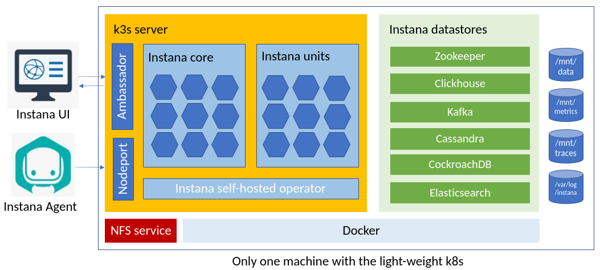

# Self-hosted K8s Instana deployment on single or dual nodes over k3s

This util helps you launch the self-hosted Instana for Kubernetes in a k3s cluster (single or multiple node) automatically which can be used for quick demo, PoC, or dev environment. Tested on Ubuntu.

## Overview

Typically, you need two Ubuntu VMs:

| Machine  | Resource
|:---------|:--------
| machine1 | 16 core, 32G memory, 4 1T disks
| machine2 | 16 core, 64G memory, 250G disk

* Use machine1 to install Instana databases, NFS service (for tracing spans persistence).
* Use machine2 to install KIND cluster and Instana workloads run on it.


However, with 209's Pod Anti Affinity change, you can use only one 64G memory machine to run everything on it.
k3s is used to reduce the overall footprint and facilitate the single node deployment.



## How to run?

Clone this Git repository to one machine, then run the `stan.sh` to start the installation.

Before you install, make sure you define the following settings using environment variables:

```console
export INSTANA_DOWNLOAD_KEY="your download key"
export INSTANA_SALES_KEY="your sales key"
```

### Bring up environment

Install docker, setup k3s, configure network and NFS:

```console
./stan.sh up k3s
```

Install Instana console and corresponding databases:

```console
./stan.sh up db <instana-console version>
```
Note: instana-console version is optional, if omitted, it will use the latest one matching instana-kubectl major version.


Bring up Instana workloads:

```console
./stan.sh up instana <instana-kubectl version>
```
Note: instana-kubectl version is optional, if omitted, it will use the latest version.


### Clean up

To take down Instana workloads on your machine:

```console
./stan.sh down instana
```

To take down Instana databases on your machine:

```console
./stan.sh down db
```

To take down k3s cluster on your machine:

```console
./stan.sh down k3s
```


## How to access?

After Instana is launched, to access Instana UI, open https://${INSTANA_FQDN} in browser, username: admin@instana.local, password: passw0rd.

Here $INSTANA_FQDN is the hostname for the machine that runs k3s server and Instana workloads.
